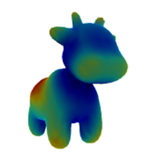
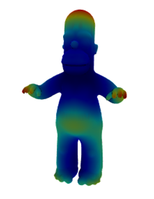
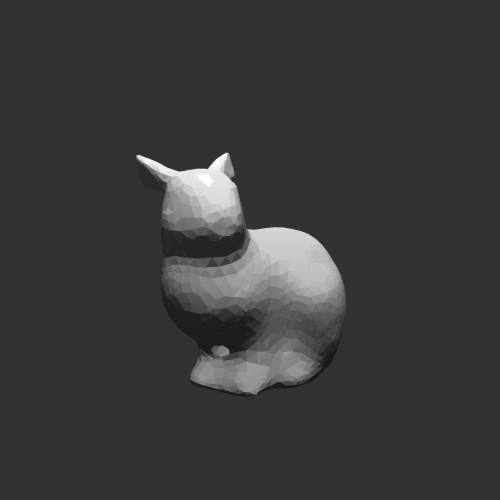
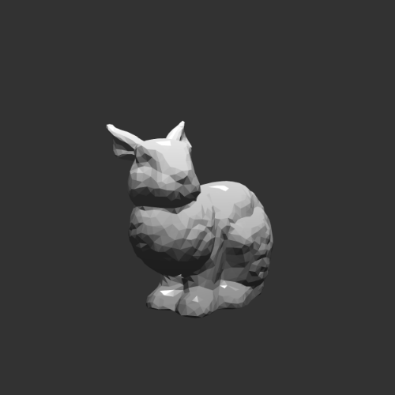

# Heat Kernel Signature

A project on implementing Heat Kernel Signature with Python and Tensorflow as described in [1]. 

Heat Kernel Signature (HKS) is a geometry descriptor based on the heat kernel. The HKS is a function of  and , which simplifies the Heat Kernel which is a function of ,  and . Briefly, heat kernel could be interpreted as amount of heat diffused from a point  to another point  in time , while heat kernel signature could be interpreted as the amount of heat diffused from a point  back to itself in time . This allows a reduction in the number of dimensions (from 3 to 2) for a geometry descriptor.

In this project, computation of heat kernel signature is implemented for a mesh using the Mesh Laplacian Operator, L, which is the discrete approximation of the Laplace-Beltrami operator. As mentioned above, the details of the method could be found in [1].

- To demonstrate the usage of the module, a notebook is created: `Implementation_of_HKS.ipynb`.
- To demonstrate an application of HKS, a notebook is created: `Optimisation_with_HKS.ipynb`.

The following images show the HKS computed for a cow mesh and a Homer mesh using the implementation in this project.

  <table>
    <tr>
      <th style="text-align:center">Cow mesh</th>
      <th style="text-align:center">Homer mesh</th>
    </tr>
    <tr>
      <td align="center">
        
      </td>
      <td align="center">
        
      </td>
    </tr>
  </table>

The following gif and image shows the output of the second notebook on the application of HKS. The smoothed mesh is transformed via optimisation of the error between the HKS's of the smoothed mesh and ground truth (its original mesh before smoothing). The gif shows the smoothed mesh at each iteration as it slowly transforms into the original mesh.

  <table>
    <tr>
      <th style="text-align:center">Smoothed mesh</th>
      <th style="text-align:center">Original mesh</th>
    </tr>
    <tr>
      <td align="center">
        
      </td>
      <td align="center">
        
      </td>
    </tr>
  </table>

## Files:
- `Images/`: Contains images for the ReadMe file.
- `heat_kernel_signature.py`: Module containing implementation of the Heat Kernel and Heat Kernel Signature.
- `Implementation_of_HKS.ipynb`: To demonstrate the usage of the module.
- `Optimisation_with_HKS.ipynb`: To demonstrate an application of HKS.
- Files with `.obj` extensions: Meshes used in the notebooks for demonstration.

### Author
- Chia Jing Heng (andreusjh@gmail.com, jhc71@cam.ac.uk) - Final year engineer at University of Cambridge

### Supervisor
- Dr Cengiz Oztireli

### Reference
[1] Jian Sun, Maks Ovsjanikov, Leonidas Guibas, "A Concise and Provably Informative Multi-scale Signature Based on Heat Diffusion", in Computer graphics forum, volume 28,
pages 1383–1392, 2009
